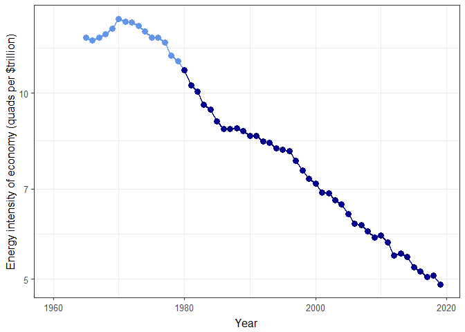

Instructions for Bottom-Up Decarbonization Policy Analysis
================
Jonathan Gilligan
2021-03-29

-   [Introduction](#introduction)
    -   [Data Resources](#data-resources)
        -   [Using the interactive web
            application:](#using-the-interactive-web-application)
-   [Background and Context](#background-and-context)
    -   [Growth Rates and Trends](#growth-rates-and-trends)
-   [The Assignment](#the-assignment)
    -   [Outline:](#outline)
    -   [Detailed steps:](#detailed-steps)

# Introduction

The purpose of this lab is to get a sense of the challenges to cutting
emissions significantly by analyzing a two representative
emissions-reduction policies. These policy analyses will follow the
methods Roger Pielke used in Chapters 3–4 of *The Climate Fix*.

I encourage you to work with a partner on this lab, but you should write
up your own lab report individually.

## Data Resources

To make things simple for you, I have prepared an interactive web
application, available at
&lt;<https://ees3310.jgilligan.org/decarbonization/>}, with almost all
the data you will need for this project. It contains historical data on
population, GDP, energy consumption, and CO<sub>2</sub> emissions for
many countries and regions of the world.

I have also provided an R package that you can install on your own
computer through R Studio:

``` r
library(pacman)
p_load_("kayadata")
```

Finally, there is an experimental version of the interactive web
application that you can install and run on your computer using RStudio,
but it is still experimental and may not work perfectly. You can install
it in RStudio like this:

``` r
library(pacman)
p_install_gh("jonathan-g/kayatool")
```

and then you can run the application like this:

``` r
library(kayatool)
launch_kayatool()
```

**Note:** you should not put `launch_kaya_tool()` in RMarkdown
documents, like your lab report, because it’s for launching an
interactive web application, which is not something that makes sense in
a document. Also, launching an interactive application when you knit
your report will prevent the report from knitting correctly.

### Using the interactive web application:

To use the decarbonization web app, start by selecting a country,
region, or group of countries on the left-hand control panel. Then you
can set the parameters for your policy goals: The target year for
accomplishing the emissions reductions, the reductions you hope to
achieve for the country or region, and the reference year.

For instance, if your goal is for emissions in 2050 to be 80% less than
they were in 2005, you would put 2050 for the target year, 80% for the
emissions reduction, and 2005 for the reference year.  
If you want to indicate a growth in emissions, rather than a reduction,
just enter a negative number for the emissions reduction.

You can also select what year to use for starting the calculation of
bottom-up trends in the Kaya-identity parameters population *P*,
per-capita gross-domestic product *g*, energy intensity of the economy
*e*, and carbon intensity of the energy supply *f*. When you calculate
decarbonization rates in this homework project, you will be focusing on
the carbon intensity of the economy, which is given by the product *ef*.

After you have set the parameters you want, the bottom of the left panel
will show a “Bottom-up Analysis” table that shows the average percentage
growth rates for the Kaya parameters, their actual values in 2017, and
the bottom-up projections for what their values will be in the target
year (2050 by default).

The tabs on the right-hand side of the web page show:

-   “**Trends:**” shows historical trends and the calculated growth rate
    for the Kaya parameters. You select a variable (*P*, *g*, *e*, *f*,
    or various multiples *ef*, *G* = *P**g*, *E* = *P**g**e*, or
    *F* = *P**g**e**f*) The app shows two graphs: on the right, the
    value of the parameter and on the left, the natural logarithm of the
    parameter, which we use to calculate percentage growth rates. The
    graphs show the points that are used in calculating the trends in
    darker red and the points not used in the trend calculation in
    lighter red. If you change the starting year on the left-hand panel,
    you will see the colors of the dots change to reflect this.

    The trend is shown in black on the left-hand graph. If the quantity
    is changing at a steady rate, the data points will follow a straight
    line (the trend line). Sometimes you will see that the variables *e*
    and *f* do not seem to be changing at a steady rate, but the product
    *ef* is. Explore the trends for the different variables and notice
    which seem to be following a steady growth or reduction and which do
    not.

    If you hold the mouse pointer over a data point on either graph, a
    tool-tip will pop up showing the value of that variable in that
    year.

-   “**Calculations**” shows the steps for you to follow in this lab
    exercise.

-   “**Implied Decarbonization**” shows the historical trend in the
    carbon intensity of the economy (*ef*) and the implied future
    changes in order to meet the policy goal that you set.

-   “**Energy Mix**” shows the mixture of energy sources (coal, natural
    gas, oil, nuclear, and renewables) that provide the country or
    region’s energy supply. From this page, you can download the energy
    mix for the country you’re looking at as a text file, using
    comma-separated value (csv) format, which you can read into R,
    Excel, or any other common data anlysis program.

-   “**Historical**” shows a table of historical values for the
    different Kaya parameters. This is a convenient place to look up the
    exact numbers for your country in a particular year. This sheet also
    has a download button that lets you download the data in a `.csv`
    file.

# Background and Context

The basic framework for your analysis will be the Kaya identity:
*F* = *P* × *g* × *e* × *f*,
where *F* is the CO<sub>2</sub> emissions (in million metric tons of
carbon per year), *P* is the population (in billion people), *g* is the
per-capita GDP (in thousands of dollars per person per year), *e* is the
energy intensity of the economy (in quads per trillion dollars of GDP),
and *f* is the carbon intensity of the energy supply (in million metric
tons of carbon dioxide per quad).[1] A quad means one quadrillion
British thermal units (BTU) of energy. One quad is approximately equal
to 8 billion gallons of gasoline or 36 million tons of coal. It is
roughly equal to the electricity used by 26 million homes in a year, or
the amount of electricity generated by 15 nuclear power plants in a
year.

We will also focus on the carbon intensity of the economy (in metric
tons of CO<sub>2</sub> emissions per million dollars of GDP), which
equals *e* × *f*.[2]

## Growth Rates and Trends

We will assume that all of the rates of change in the growth and
decarbonization trends we are studying will be constant from year to
year. A constant percentage rate of change implies that the quantity
follows an exponential growth function, so if you know the values for
*P*, *g*, *e*, and *f* in 2019, then at some future year *y*:

$\\def\\lefteqn\#1{\\rlap{\\displaystyle{\#1}}}$
$\\def\\alintertext\#1{\\rlap{\\displaystyle{\\text{\#1}}}}$
$$
\\begin{aligned}
  P(y) &= P(2019) \\times \\exp(r\_P (y - 2019)),\\\\
  g(y) &= g(2019) \\times \\exp(r\_g (y - 2019)),\\\\
  e(y) &= e(2019) \\times \\exp(r\_e (y - 2019)),\\\\
  \\alintertext{and}
  f(y) &= f(2019) \\times \\exp(r\_f (y - 2019)),\\\\
\\end{aligned}
$$
where *r<sub>P</sub>* is the growth rate of the population,
*r<sub>g</sub>* is the growth rate of the per-capita GDP, etc.
Increasing energy efficiency and/or decarbonization of the energy supply
mean that *r<sub>e</sub>* and/or *r<sub>f</sub>* are negative.

------------------------------------------------------------------------

**Remember that you have to divide percentages by 100 to get the rates
for these equations: if *r* is 3%, you use 0.03, not 3.0 in the
equations.**

**In your math classes and on your calculator, you have probably seen
the exponential function exp(*x*) written as *e<sup>x</sup>*, where *e*
is the base of the natural logarithm (*2.718…*). But since I am using
the letter *e* to represent the energy intensity of the economy (the
energy consumption divided by the GDP), I am writing it as exp(*x*) so
you won’t get confused by two different meanings of “*e*.” Also, in R
the exponential function is `exp()`.**

------------------------------------------------------------------------

Because of the properties of the exponential function, when you multiply
two or more quantities together, the rate of change of the product is
the sum of the rates of change of each of the quantities:
$$
\\begin{aligned}
  \\mathrm{GDP}(y) &= P(y)\\times g(y)\\\\
    &= P(2019) \\times \\exp(r\_p (y - 2019)) 
    \\times g(2019) \\times \\exp(r\_g (y - 2019))\\\\
    &= P(2019)\\times g(2019)
    \\times \\exp((r\_P + r\_g) (y - 2019))\\\\
    \\alintertext{so}
  r\_{\\mathrm{GDP}} &= r\_{P\\times g} = r\_P + r\_g.
\\end{aligned}
$$

The web app does these calculations so you can check your results. So
that errors in the first parts of a problem don’t cascade through the
whole exercise, you should work the problems exercises with RMarkdown
and compare your work to the “Bottom-up Analysis” table to make sure you
know how to do it.

# The Assignment

For this lab, you will do a bottom-up analysis for a policy to reduce
the greenhouse gas emissions for the OECD (the Organization for Economic
Cooperation and Development, a group of highly industrialized countries)
80% below 2005 levels by the year 2050

For the bottom-up analysis, use the Kaya Identity to make reasonable
extrapolations of the population and per-capita GDP through 2050.

<!--
Repeat the steps below for each country or region:
-->

### Outline:

To analyze the policy:

1.  Get the Kaya identity data for the OECD
2.  Figure out appropriate starting years for calculating the historical
    trends for the Kaya variables *P*, *g*, *e*, and *f*.
3.  Calculate the *historical trends* for the Kaya variables from the
    starting year you determined in step (2).
4.  Use the *historical trends* to extrapolate projected values for *P*,
    *g*, *e*, and *f* in 2050.
5.  Calculate the policy goal for emissions *F* in 2050. This uses the
    policy criteria (*F* in 2050 should be 80% less than in 2005) and
    the measured emissions *F* in 2005, from the Kaya data for the OECD.
6.  Calculate the *implied rate of change* of *F* between 2019 and 2050,
    in order to reduce emissions to the policy goal that you calculated
    in step (5). This is the average fraction that *F* must be reduced
    each year between now and 2050 in order to meet the goal, so if the
    implied rate is  − 0.05, then *F* must be reduced by 5% each year,
    on average.
7.  Combine the *implied rate of change* of *F* with the *historical
    trends* of *P* and *g* to calculate the *implied rate of change* of
    *ef* that you calculated in step (3) in order to meet the policy
    goal from step (5).
8.  Compare the *implied rate of change* of *ef* that you calculated in
    step (7) to the *historical trend* of *ef* that you can determine
    from the *historical trends* of *e* and *f* that you calculated in
    step (3).

### Detailed steps:

1.  Use the `kayadata` package in RStudio to load the data for the OECD.
    Below is an example of looking up the data for the United States:

    ``` r
    library(kayadata)
    us_data = get_kaya_data("United States")
    us_latest = us_data %>% slice_max(year)
    ```

    You can get a list of all the countries and regions that are
    available from `kaya_region_list()`.

2.  Next, open up the interactive application at
    [ees3310.jgilligan.org/decarbonization](https://ees3310.jgilligan.org/decarbonization),
    seelect OECD as the region. Leave the “Calculate trends starting in”
    at its default value (1980). Go to the “Trends” tab and look at the
    graphs of ln(*P*), ln(*g*), ln(*e*), ln(*f*), and ln(*ef*).

    -   For each graph compare the real data (in red) to the trend line
        (the straight blue line).

    -   Does the trend line look a like a good description of the data?

    -   Is there a better starting year for calculating trends? If so,
        adjust \`\`Calculate trends starting in’’ to this year and make
        note of the year.

    -   You should also plot these in your report using RMarkdown.
        Following from the example above, you can use the `plot_kaya`
        function:

        ``` r
        plot_kaya(us_data, "e", log_scale = TRUE, font_size = 12)
        ```

        <!-- -->
        Use plots like the one above to examine trends in *P*, *g*, *e*,
        and *f*. Be sure to set `log_scale = TRUE` in the `plot_kaya`
        function because a constant percentage rate of change
        corresponds to a linear trend in the logarithm of the variable.

3.  In your report, discuss whether you anticipate a problem if we make
    policy by assuming that the Kaya identity variables will follow the
    trend line for the next several decades?

4.  Next, calculate the rates of change of *P*, *g*, *e*, and *f* (the
    Population, per-capita GDP, energy intensity of the economy, and
    carbon-intensity of the energy supply) from your starting year
    through 2019, using the `lm` function in R.

    A constant rate of change is represented by a linear relationship
    between the natural logarithm of the kaya variable and time: for the
    variable `P` (population), we would write this formula in R as
    `log(P)~year`.

    Here is an example of calculating the rate of change of *e* (the
    energy intensity of the economy) for the United States, using the
    variable `us_data` that you calculated above:

    ``` r
    # Load the broom library for organizing lm results
    library(broom)

    e_trend = us_data %>% filter(year >= 1980) %>%
      lm(log(e) ~ year, data = .) %>%
      tidy() %>% 
      filter(term == "year") %>% 
      pull(estimate)
    ```

    For more detailed explanation of the code above, see the handout
    “New Tools for Data Analysis.”

    Here, we find that `e_trend` = -0.0193 (-1.93% per year).

    You can check your results against the interactive web application
    by looking at the rates of change reported on the “Trends” tab. Be
    sure to set the start year on the web app to the same values that
    you used for calculating the slopes in RMarkdown.

    These numbers are the slopes of the trend lines that you looked at
    in part 2.

5.  Using the rates of change that you determined in part 4, use the
    formulas from the “Growth Rates and Trends” section to compute the
    values for *P*, *g*, *e*, and *f* in the year 2050.

    Next, use the growth rates of *P*, *g*, *e*, and *f* to calculate
    the growth rate of the total emissions *F*. Calculate the total
    CO<sub>2</sub> emissions (*F*) from the OECD in 2050, assuming that
    emissions continue to grow at historical rates.

    It may be useful to define functions for frequently used (e.g., see
    the example `growth` function in the handout on “New Tools for Data
    Analysis”)

    Check your work against the bottom-up numbers in the \`\`Bottom-Up
    Analysis’’ table on the bottom of the left-hand pane of the web
    application.

6.  Calculate the emissions target: Set the reference year for emissions
    reduction to 2005, and set the target emissions reduction to 80%.

    Set the target year in the web app to 2050; set the reference year
    to 2005; set the emissions reduction to 80%.

    How much CO<sub>2</sub> (*F*) would the OECD emit in 2050 in order
    to meet your policy goal?

    Let’s work an example using the Middle East:

    ``` r
    F_2005_middle_east = get_kaya_data("Middle East") %>% 
      filter(year == 2005) %>% pull(F)
    F_2005_middle_east
    ```

        ## [1] 1366.568

    ``` r
    middle_east_reduction = 0.32
    F_goal_middle_east = F_2005_middle_east * (1 - middle_east_reduction)
    F_goal_middle_east
    ```

        ## [1] 929.2662

    Check this result against the interactive web application.

7.  Look up what the CO<sub>2</sub> emission is in 2019 and calculate
    the rate of change in *F* that would be necessary to achieve your
    policy target. For the 2050 calculation:

    1.  Calculate the ratio of *F*<sub>2050</sub>/*F*<sub>2019</sub>.
    2.  Take the natural logarithm of this ratio (in R, the natural
        logarithm function is `log()`; on your calculator it is “LN”).
    3.  Divide the logarithm by the number of years (2050 − 2019). This
        is the rate of change of *F*. A positive number means growth and
        a negative number means a reduction. The percentage rate of
        change per year is 100 times this number.

    For our Middle East example:

    ``` r
    F_2017_middle_east = get_kaya_data("Middle East") %>% 
      filter(year == 2017) %>% pull(F)
    r_F_middle_east = log(F_goal_middle_east / F_2017_middle_east) / 
      (2050 - 2017)
     r_F_middle_east
    ```

        ## [1] -0.02437718

    so total emissions for the Middle East would need to drop by -2.44%
    per year between 2019 and 2050

8.  Now calculate the decarbonization rate implied by the policy goal.
    This is the rate of reduction of *ef*, the carbon intensity of the
    economy. *F* = *P**g**e**f*, so
    *r*<sub>*F*</sub> = *r*<sub>*P*</sub> + *r*<sub>*g*</sub> + *r*<sub>*e*</sub> + *r*<sub>*f*</sub>.
    Subtract the projected *r<sub>P</sub>* and *r<sub>g</sub>* (look
    them up in the \`\`Bottom up Analysis’’ table) from *r<sub>F</sub>*,
    which you just calculated in step\~7, to get the rate of change of
    *ef*. Multiply the rate of change of *ef* by -1 to get the rate of
    decarbonization (because negative rate of change is a positive rate
    of decarbonization and vice-versa). Multiply by 100 to get the
    percent implied rate of decarbonization.

9.  How does the implied rate of decarbonization for the OECD compare to
    the historical rate of decarbonization (i.e., the trend in *ef*
    reported in the “Bottom up Analysis” table)?

[1] One metric ton = 1000 kg = 1.1 English tons = 2200 pounds

[2] Note that *e* is in units of quads per trillion dollars of GDP and
*f* is in units of million metric tons of CO<sub>2</sub> per quad, so if
you multiply the units you get million metric tons of CO<sub>2</sub> per
trillion dollars of GDP, which equals metric tons of CO<sub>2</sub> per
million dollars of GDP.
